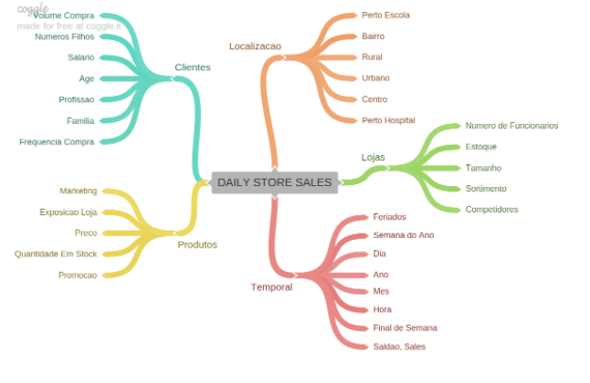

# Sales Prediction of Rossmann Pharmacy Chain

**Aviso**: este projeto foi inspirado no desafio "Rossmann Store Sales" publicado no kaggle (https://www.kaggle.com/c/rossmann-store-sales). É um projeto fictício mas com todas as etapas de um projeto real, com o objetivo de reproduzir o ambiente empresarial.

## Cenário de negócios
Rossmann é uma empresa europeia que opera mais de 3.000 drogarias em 7 países. Em uma reunião mensal de resultados, o CFO solicitou aos gerentes das lojas a previsão de vendas (faturamento) para as próximas 6 semanas, pois ele precisa saber quanto cada loja pode contribuir financeiramente para uma reforma na rede, que está padronizando suas lojas.

## Metodologia da solução
A resolução do desafio foi realizada seguindo a metodologia CRISP (CRoss-Industry Standard Process for data mining), que é uma abordagem cíclica que agiliza a entrega de valor em projetos de tecnologia.

Minha estratégia para resolver esse desafio foi testar modelos de machine learning para prever vendas para as próximas 6 semanas e decidir qual trará o melhor resultado para a empresa.
Após a modelagem, a solução entregue foi um bot de telegrama que recebe o número da loja e retorna a previsão para as próximas semanas.

## Coleta e limpeza de dados

O primeiro passo foi coletar (do kaggle) e entender os dados; logo após, ocorreu a limpeza do banco de dados e o tratamento dos valores ausentes.  
São 1017209 registros de vendas para 1115 lojas diferentes, contendo diferentes atributos como: "date", "store_type", "customers", "sortment", "school_holiday", "open", "promo2", "sales", entre outros . A explicação de cada um dos atributos está disponível no quadro abaixo.  
Para completar a etapa de limpeza dos dados, foram retiradas funcionalidades que não estarão disponíveis no momento da previsão, como o número de clientes, que só será conhecido no dia da venda e, portanto, seria impraticável treinar o modelo com tal variável.

As variáveis do dataset original são:

Variável | Definição
------------ | -------------
|store | id único de cada loja.|
|day_of_week | indica o dia da semana que era aquele dia (assumindo 1-Sun -> 7-Sat).|
|date | data do registro.|
|sales | faturamento da loja naquele dia.|
|customers | número de clientes na loja naquele dia.|
|open | loja aberta ou fechada: (0 = closed, 1 = open).|
|state_holiday | feriado nacional (a = public holiday, b = Easter holiday, c = Christmas, 0 = Dia Comum).|
|school_holiday | indica se a loja naquele dia foi afetada pelo fechamento das escolas públicas.|
|store_type | indica qual dos 4 modelos distintos é esta loja: (a, b, c, d).|
|assortment | indica o nível de sortimento da loja: (a = basic, b = extra, c = extended).|
|competition_distance | indica a distancia em metros do competidor mais próximo.|
|competition_open_since_month | indica mês aproximado da abertura do competidor mais próximo.|
|competition_open_since_year | indica ano aproximado da abertura do competidor mais próximo.|
|promo | indica se a loja está com uma promoção ativa naquele dia.|
|promo2 | é uma promoção contínua e consecutiva: (0 = store not participating, 1 = store participating).|
|promo2_since_week | indica a semana do calendário onde a loja entrou em Promo2.|
|promo2_since_year | indica o ano onde a loja entrou em Promo2.|
|promo_interval | indica os meses de início anual onde Promo2 é iniciada (ex: "Feb,May,Aug,Nov").|

As variáveis derivadas são:
Variável | Definição
------------ | -------------
|competition_since | data desde que existem competidores. |
|competition_time_month | número de meses desde que a competição iniciou. |
|promo2_since | data desde que a Promo2 está ativa. |
|promo2_time_week | números de semanas em que a Promo2 ficou ativa. |

## Análise exploratória de dados guiada por um mapa mental de hipóteses

O próximo passo foi realizar a análise exploratória de dados (EDA). Mas antes, foi feito um mapa mental de hipóteses para orientar a EDA, gerar insights e entender um pouco mais sobre o banco de dados e os atributos mais importantes.

Com o diagrama de atributos acima, várias hipóteses foram geradas; as que foram julgados mais relevantes foram selecionadas (listados abaixo) e então a EDA realmente começou.

1. Lojas com maior sortimentos deveriam vender mais.
2. Lojas com competidores mais próximos deveriam vender menos.
3. Lojas com competidores à mais tempo deveriam vendem mais.
4. Lojas com promoções ativas por mais tempo deveriam vender mais.
5. Lojas com mais dias de promoção deveriam vender mais.
7. Lojas com mais promoções consecutivas deveriam vender mais.
8. Lojas abertas durante o feriado de Natal deveriam vender mais.
9. Stores should sell more in the second half of the year
9. Lojas deveriam vender mais ao longo dos anos.
10. Lojas deveriam vender mais no segundo semestre do ano.
11. Lojas deveriam vender mais depois do dia 10 de cada mês.
12. Lojas deveriam vender menos aos finais de semana.
13. Lojas deveriam vender menos durante as feriados escolares.

A discussão de cada hipótese para validá-la ou refutá-la encontra-se no arquivo do notebook. Assim como os gráficos tornando a vizualização das hipóteses mais intuitiva  
Segue abaixo o resumo da análise das hipóteses 1, 10 e 13:

### H1. Lojas com maior sortimentos deveriam vender mais.

No primeiro gráfico, temos um comparativo dos tipos de sortimentos de lojas e suas medianas de vendas. Nele podemos perceber que loja com sortimento mais farto (extended e extra) vendem mais que as lojas com sortimento básico. Já no segundo gráfico temos as séries temporais dos 3 sortimentos diferentes durante todo o período do Dataset feitas através de uma média móvel de 4 períodos. Fica claro uma tendência de crescimento nas lojas com sortimento extra.

Um insight que pode ser extraído dessa análise seria identificar produtos de lojas que tem sortimento maior (extra e extended) e comparar quais têm sido sucesso de vendas mas não estão disponíveis em lojas com sortimento básico. Assim, em uma tentativa de aumentar o ticket médio as lojas com sortimento básico poderiam incluir esses produtos em seu mix.

### H2. Lojas com competidores mais próximos deveriam vender menos. **Falsa**

Diante dos graficos acima, conseguimos analisar que há uma variabilidade muito grande entre as medianas de vendas por distâncias, não há essa relação. Isso também é confirmado pelo valor baixo resultante do cálculo da correlação de Pearson (gráfico mais à direita).

Esse é um tipo de hipótese que não trouxe um grande insight sobre o negócio, como nossa intenção é fazer uma previsão de vendas, trata-se de um problema de regressão. Em problemas de regressão, para encontrar grande valor em um atributo, esperamos ver uma relação clara ao plotar o gráfico de dispersão da variável estudada versus a variável resposta. Não é isso que acontece, pois não há um padrão de alta ou baixa nas vendas de farmácias com competidores mais próximos em relação a lojas com competidores mais distantes.

### H13. Lojas deveriam vender menos durante as feriados escolares: **Falsa**

Com a análise do gráfico acima, percebe-se que nos fériados escolares, pela mediana, são realizadas mais vendas do que em dias regulares.
Nota-se que, com exceção de outubro e dezembro, na mediana, o montante de vendas é maior nos feriados escolares. Destaque para as vendas nos feriados escolares de março e novembro.

## Data preparation (standardization and feature selection)

Após a etapa da Análise Exploratória de Dados, foi realizada a preparação dos dados para que os modelos de Machine Learning pudessem ser implementados posteriormente. Primeiro foi feito o tratamentodas das variáveis numéricas, como nenhuma variável tinha uma distribuição normal, não foi aplicada a normalização. Para atributos que não possuiam muitos outliers foi aplicada uma técnica de Reescala denominada MinMaxScaler e  aqueles que tinham outliers expressivos, foi aplicada outra técnica de Reescala chamada RobustScaler.

Já as variáveis categóricas, tiveram um processo de Encoding aplicado à elas. As que represatavam um estado passaram pelo One Hot Encoding, as que não possuiam uma relação explicita entre suas categorias passaram por Label Encoding, e em variáveis hierárquicas foi aplicado o Ordinal Encoding. Atributos de natureza ciclica tiveram a sua natureza transformada por meio de funções seno e cosceno, para que ficasse explicita essa natureza cíclica para o aprendizado dos modelos de machine learning

O próximo passo foi identificar os atributod mais relevantes para o treinamento de modelos de aprendizado de máquina.
Para isso, além do conhecimento adquirido durante a EDA, foram utilizadas as implementações em Python do pacote Boruta.
As características escolhidas por Boruta estão descritas no notebook.

## Machine learning modeling

Quatro modelos diferentes (regressão linear, regressão linear regularizada - Lasso, random forest e XGBoost ) foram avaliados usando a validação cruzada em base contínua, esquematicamente representada a seguir.

Começou com uma parcela reduzida dos dados de treinamento, cujas últimas 6 semanas foram separadas para validação; em seguida, o modelo foi treinado e seu desempenho foi calculado.  
Novas iterações foram realizadas, cada vez aumentando o conjunto de dados de treinamento e sempre separando as últimas 6 semanas para o teste.  
O desempenho da validação cruzada foi a média de cada uma dessas iterações.

Os resultados em termos de erro médio absoluto (MAE), erro percentual absoluto médio (MAPE) e erro quadrático médio (RMSE) foram:

|Model|MAE|MAPE|RMSE|
|-----------------------------|------------------|-------------|------------------|
|Random forest regressor      |837.68 +/- 219.1 |0.12 +/- 0.02|1256.08 +/- 320.36|
|XGBoost regressor            |1030.28 +/- 167.19 |0.14 +/- 0.02|1478.26 +/- 229.79|
|Linear regression            |2081.73 +/- 295.63|0.3 +/- 0.02 |2952.52 +/- 468.37|
|Regularized linear regression|2116.38 +/- 341.|0.29 +/- 0.01|3057.75 +/- 504.26|
	
Embora o modelo de random forest tenha sido o melhor, o modelo escolhido para prosseguir com o ajuste dos hiperparâmetros foi o XGBoost. A razão disso é que é um modelo muito mais leve para operar em produção e não apresenta diferença significativa de desempenho; a operacionalidade em produção é um requisito extremamente importante neste projeto.

## Hyperparameter tuning
Usando o procedimento de  random search com alguns conjuntos de valores para os seguintes parâmetros: "n_estimators", "eta", "max_depth", "subsample", "colsample_bytree" e "min_child_weight", foram realizadas 5 iterações diferentes do XGBoost, todas avaliadas por validação cruzada. 
O modelo de XGBoost escolhido como vencedor foi definido pela melhor performace no indicador RMSE. Os parâmetros dele são apresentados abaixo:
 
- n_estimators = 3000
- eta = 0.03,
- max_depth = 5
- subsample = 0.7,
- colsample_bytree = 0.7
- min_child_weight = 3

Após a escolha desses parâmetros, o modelo foi treinado com o dataset de treino inteiro. A performance nos dados de teste foi:

|Model|MAE|MAPE|RMSE|
|----------------|------|----|-------|
XGBoost regressor|	664.97|0.097|957.77|

## Business performance

Finalmente, com o modelo treinado, é hora de traduzir o desempenho do modelo em desempenho de negócios.
Considerando o MAE obtido na previsão para cada loja, durante o período de teste, foram projetados os melhores e piores cenários de vendas para cada loja e depois essas projeções foram somadas para ilustrar o desempenho da rede de farmácias como um todo.

O desempenho de vendas esperado para a rede de farmácias Rossmann  nas próximas 6 semanas, pode ser visualizado na tebela abaixo:

|Cenário|Valores
|----------|---------|
|Predições no cenário realista|$285,860,497.77|
|Predições no cenário pessimista|$285,115,015.71|
|Predições no cenário otimista|$286,605,979.84|

A performance geral do modelo pode ser representada pelos gráficos abaixo, aonde:  
 
- error_rate = predictions/sales  
- error = sales - predictions  

 

No geral, o modelo teve um bom desempenho.  
Mas é sempre possível melhorá-lo; seguindo a metodologia CRISP, caso seja necessária uma nova rodada, pode-se considerar treinar as lojas individualmente ou até mesmo um grupo menor delas, por exemplo. Outra possibilidade é explorar outros modelos de aprendizado de máquina.  
No entanto, deve-se levar em consideração o prazo de entrega das previsões e o desempenho do modelo já em produção. Algo muito pesado ou demorado também é impraticável, mesmo que tenha um desempenho excepcional.  
É um trade-off que deve estar intimamente alinhado com a gestão da empresa.  
Mais detalhes sobre o desempenho dos negócios estão disponíveis no notebook.

## Model in production

O modelo foi finalmente colocado em produção e operado por meio de um chatbot do Telegram. Para isso, além do modelo final treinado, foi criada uma classe em python com todo o pipeline de processamento de dados, um manipulador de API e um aplicativo para gerenciar as mensagens. Todos os arquivos foram hospedados no Heroku (https://www.heroku.com/); os dados de produção também foram armazenados em sua nuvem.  

O esquema a seguir representa todos esses arquivos.

Em seguida, podemos ver uma demonstração do robô desenvolvido em telegram retornando a previsão de vendas para diversas lojas consultadas. A demonstração foi gravada na versão do telegram para Desktop, mas caso seja de preferência do usuário, ele tambem pode ser acionado via celular:  

  

     

